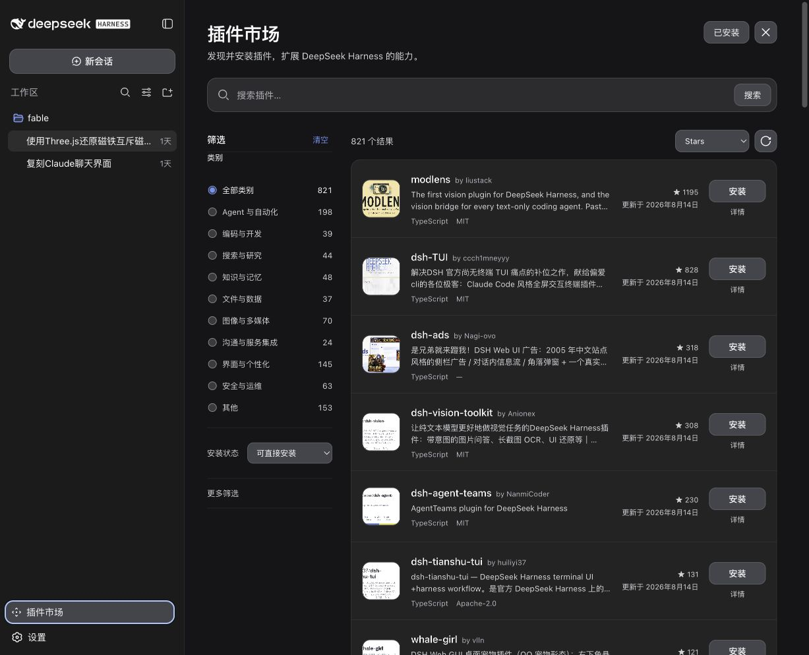
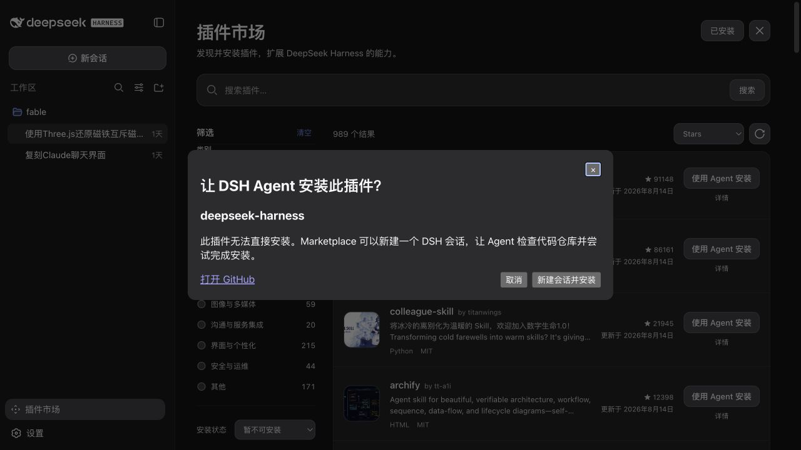

# DSH Plugin Marketplace

给 [DeepSeek Harness](https://github.com/deepseek-ai/DeepSeek-Harness) 开了一家插件杂货铺。

你当然可以继续在 GitHub 搜 `dsh-plugin`，打开二十个 README，把浏览器标签页养成孔雀；也可以点开 Marketplace，先看看有什么，再决定要不要往 DSH 里塞。

这个项目没有重新发明插件，也没有给安装按钮接区块链。它只想把**找插件、看插件、装插件、管插件**这几件本来有点散的事，老老实实放到一起。



## 所以，这玩意儿解决什么问题？

过去找一个 DSH 插件，大概是这样的：

> GitHub 搜索 → 打开仓库 → 判断它到底是不是插件 → 阅读安装说明 → 复制命令 → 漏掉半行 → 开始反思人生。

Marketplace 把流程缩短成：

> 搜一下 → 看一眼 → 想清楚 → 点安装。

它会自动整理带有 `dsh-plugin` Topic 的公开仓库，并在 DSH 里提供搜索、筛选、详情、安装和已安装管理。

一句话总结：**少一点赛博考古，多一点明白消费。虽然这里不收费。**

## 安装

不需要先全局安装 `dsh`。Windows PowerShell、Linux 和 macOS 都可以复制这一条：

```bash
npx -y --package @deepseek-ai/dsh dsh plugin --profile web add untr-dsh-marketplace@latest
```

如果更习惯 `npm exec`，三端通用的等价命令是：

```bash
npm exec --yes --package=@deepseek-ai/dsh -- dsh plugin --profile web add untr-dsh-marketplace@latest
```

`npx` 和 `npm exec` 都只会临时调用 DSH CLI；持久安装的是 Marketplace 插件，`dsh` 不会因此加入系统 `PATH`。

安装完成后重启 DSH。

Marketplace 不会偷偷重启或热更新 DSH。这不是偷懒，是不想在你工作到一半时表演赛博拔电源。

<details>
<summary>我偏要从源码安装</summary>

需要 Node.js 22.19.x 或 Node.js 24 及以上版本，以及 pnpm 11.19。

```bash
git clone https://github.com/UntR/dsh-plugin-marketplace.git
cd dsh-plugin-marketplace

corepack enable
pnpm install --frozen-lockfile
pnpm --filter untr-dsh-marketplace build
pnpm --filter untr-dsh-marketplace pack

npx -y --package @deepseek-ai/dsh dsh plugin \
  --profile web add "$PWD/dsh-marketplace/untr-dsh-marketplace-0.1.4.tgz"
```

</details>

## 怎么用？不需要先看三小时教程

1. 重启 DSH，点击左下角的「插件市场」。
2. 搜名字、搜简介，或者按类别、安装状态、开发语言慢慢挑。
3. 点「详情」，先看看作者、许可证、更新时间和 README 摘要。
4. 确定不是“看起来就很刺激”的仓库，再点「安装」。
5. 安装、更新或卸载后重启 DSH，让变更正式上班。
6. 右上角的「已安装」可以统一查看、更新和卸载当前 Web Profile 里的第三方插件。

有些插件不能直接安装。遇到这种情况，Marketplace 会显示「使用 Agent 安装」：新建一个 DSH 会话，让 Agent 先读仓库，再尝试处理额外步骤。

正常的权限确认仍然有效。按钮再大，也不会自动获得尚方宝剑。



## 功能，翻译成人话

| 功能 | 人话 |
| --- | --- |
| 插件发现 | 把散落在 GitHub 的插件请到同一个屋檐下 |
| 搜索与筛选 | 按关键词、类别、安装状态和语言筛，拒绝在列表里徒步 |
| 排序 | 看 Stars、名称、更新时间或最近推送，各有各的排法 |
| 插件详情 | 安装前先看作者、许可证、版本、仓库和 README 摘要 |
| 直接安装 | 能确认是 DSH Bundle 的，交给官方 CLI 正经安装 |
| Agent 辅助安装 | 不能直装的，开个会话让 Agent 先读说明，禁止闭眼梭哈 |
| 已安装管理 | 查看、更新、卸载，不用记住昨天到底装了啥 |
| 跟随 DSH | 中英文、明暗主题都随 DSH，尽量不做显眼包 |
| 缓存兜底 | Registry 暂时抽风时，尽量显示上次成功的数据 |

## 先别急着梭哈

- 被 Marketplace 收录，**不等于**通过了安全审查，也不代表推荐或背书。
- 第三方插件是可以执行代码的。安装前看看来源、README、许可证和近期维护情况；花两分钟，总比半夜排查两小时便宜。
- 当前 DSH 基线无法自动批准依赖包的构建脚本。遇到这类插件，Marketplace 会停下来说明，不会假装勇敢。
- 插件变更需要重启 DSH 后生效，暂不支持热加载。
- 当前认真验证过的是 DSH `0.1.0-rc.6`。其他版本可能也行，但“我觉得行”不算测试报告，详见 [兼容性说明](./dsh-marketplace/COMPATIBILITY.md)。

## 我也写了插件，怎么来摆摊？

给公开 GitHub 仓库添加 `dsh-plugin` Topic，Registry 会定期发现并整理仓库信息。

不过，进市场和能直接安装是两回事：

- `dsh-plugin` Topic 负责进门；
- 规范、可识别的 DSH Bundle 负责不在门口罚站。

## 不爱了，也可以体面分手

```bash
npx -y --package @deepseek-ai/dsh dsh plugin \
  --profile web remove untr-dsh-marketplace
```

然后重启 DSH。卸载 Marketplace 不会把其他插件一起端走，我们没有这种分手习惯。

## 给想拆开看看的朋友

仓库里有两个相互独立的部分：

- [`dsh-plugin-registry`](./dsh-plugin-registry/)：发现公开插件并生成稳定的 Registry 数据；
- [`untr-dsh-marketplace`](./dsh-marketplace/)：在 DSH 中浏览 Registry，并管理当前 Profile 的插件。

本地验证：

```bash
pnpm install --frozen-lockfile
pnpm typecheck
pnpm test
pnpm build
```

还想继续往里走，可以看 [Marketplace 技术说明](./dsh-marketplace/README.md)、[DSH 接入记录](./docs/upstream-notes.md) 和 [端到端验证记录](./docs/e2e-verification.md)。

## License

[MIT](./dsh-marketplace/LICENSE)。拿去用，出问题先看日志，别先看星座。
